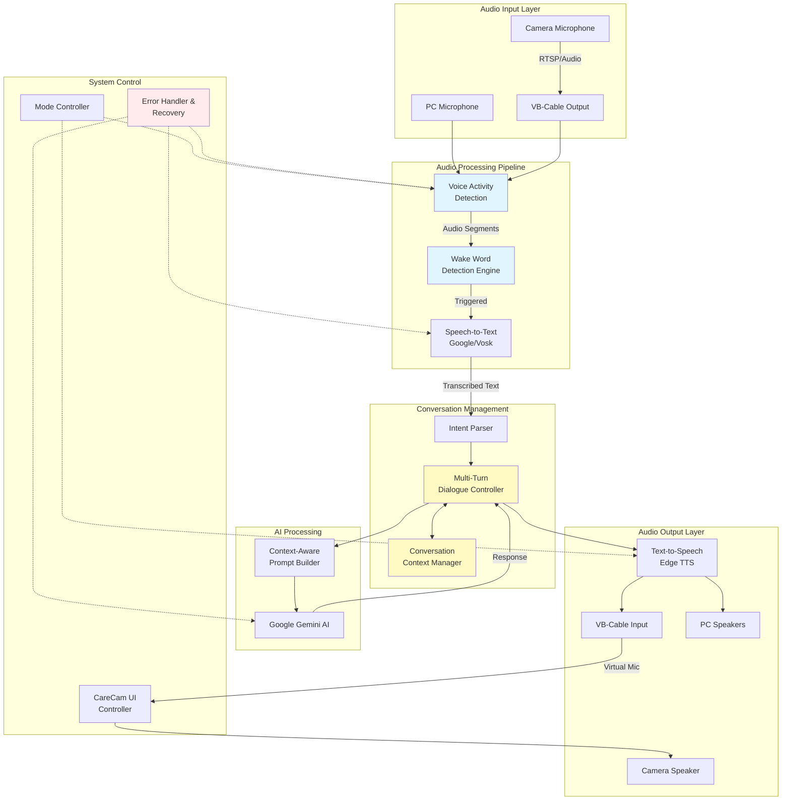
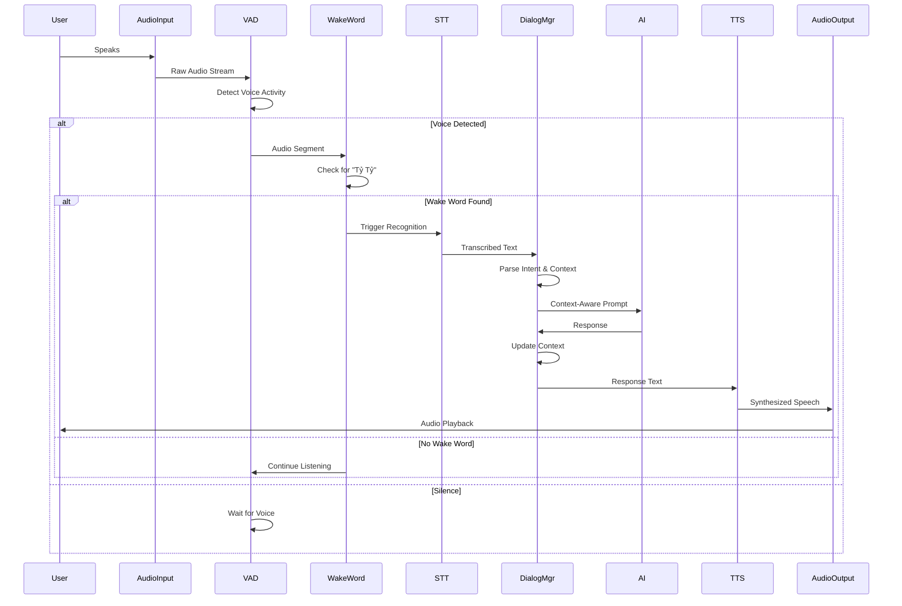

# Design Document: Chatbot Voice Interaction Upgrade

## Overview

This design document outlines the architectural improvements for the "Tỷ Tỷ" Vietnamese voice chatbot system integrated with CareCam security cameras. The upgrade focuses on enhancing voice interaction capabilities through robust wake word detection, conversation context management, multi-turn dialogue support, voice activity detection (VAD), improved audio pipeline architecture, and better error handling mechanisms. The design maintains backward compatibility with existing modules while introducing new capabilities for natural, context-aware conversations.

The system currently supports two operation modes: Basic mode (PC microphone to AI to PC speakers) and Full automation mode (Camera mic → VB-Cable → AI → VB-Cable → Camera speaker). The upgrade will enhance both modes with improved voice processing, conversation memory, and graceful error recovery.

## Architecture

### High-Level System Architecture



### Audio Pipeline Architecture



## Components and Interfaces

### Component 1: Voice Activity Detection (VAD)

**Purpose**: Detect when user is speaking vs. silence to optimize processing and reduce false wake word triggers

**Interface**:
```pascal
INTERFACE VoiceActivityDetector
  PROCEDURE initialize(config: VADConfig): Boolean
  PROCEDURE start_monitoring(audio_source: AudioStream): Void
  PROCEDURE stop_monitoring(): Void
  FUNCTION is_voice_active(): Boolean
  FUNCTION get_audio_segment(): AudioSegment
  EVENT on_voice_start(callback: Function): Void
  EVENT on_voice_end(callback: Function): Void
END INTERFACE

STRUCTURE VADConfig
  energy_threshold: Float
  silence_duration: Float
  min_speech_duration: Float
  sample_rate: Integer
  frame_length_ms: Integer
END STRUCTURE

STRUCTURE AudioSegment
  audio_data: ByteArray
  duration: Float
  timestamp: DateTime
  sample_rate: Integer
END STRUCTURE
```

**Responsibilities**:
- Monitor audio stream for voice activity using energy-based detection
- Reduce false wake word triggers by filtering non-speech audio
- Provide audio segments only when voice is detected
- Support configurable thresholds for different noise environments
- Emit events when voice starts/ends for reactive processing

**Algorithm**: Energy-based VAD with adaptive thresholding
- Calculate short-term energy of audio frames
- Compare against dynamic threshold (adjusted for ambient noise)
- Apply smoothing to prevent flickering detection
- Trigger voice_start after minimum speech duration
- Trigger voice_end after silence duration threshold

### Component 2: Enhanced Wake Word Detection Engine

**Purpose**: Robust detection of "Tỷ Tỷ" wake word using dedicated acoustic model instead of simple keyword matching

**Interface**:
```pascal
INTERFACE WakeWordEngine
  PROCEDURE initialize(model_path: String, sensitivity: Float): Boolean
  PROCEDURE set_keywords(keywords: Array<String>): Void
  FUNCTION detect(audio_segment: AudioSegment): WakeWordResult
  FUNCTION is_wake_word_only(text: String): Boolean
  PROCEDURE update_sensitivity(sensitivity: Float): Void
END INTERFACE

STRUCTURE WakeWordResult
  detected: Boolean
  keyword: String
  confidence: Float
  timestamp: DateTime
  remaining_command: String
END STRUCTURE
```

**Responsibilities**:
- Load and initialize wake word acoustic model (Porcupine/Picovoice)
- Detect wake word with high accuracy and low false positive rate
- Extract command text following wake word
- Support multiple wake word variations ("tỷ tỷ", "ty ty", "ti ti")
- Provide confidence scores for detection quality assessment

**Implementation Options**:
- **Option A**: Porcupine Wake Word Engine (recommended)
  - Pre-trained Vietnamese wake word models available
  - Low latency, runs locally
  - Free tier available for development
  - Cross-platform support
  
- **Option B**: Custom keyword spotting with WebRTC VAD
  - Use phonetic matching on transcribed text
  - Lower accuracy but no external dependencies
  - Fallback option if Porcupine unavailable

### Component 3: Conversation Context Manager

**Purpose**: Maintain conversation history and context across multiple turns to enable natural, coherent dialogues

**Interface**:
```pascal
INTERFACE ConversationContextManager
  PROCEDURE create_session(user_id: String): SessionID
  PROCEDURE end_session(session_id: SessionID): Void
  PROCEDURE add_message(session_id: SessionID, role: Role, content: String): Void
  FUNCTION get_context(session_id: SessionID, max_turns: Integer): ConversationContext
  PROCEDURE clear_context(session_id: SessionID): Void
  FUNCTION get_session_duration(session_id: SessionID): Float
  PROCEDURE set_user_preference(session_id: SessionID, key: String, value: Any): Void
  FUNCTION get_user_preference(session_id: SessionID, key: String): Any
END INTERFACE

STRUCTURE ConversationContext
  session_id: SessionID
  messages: Array<Message>
  user_preferences: Map<String, Any>
  session_start: DateTime
  last_activity: DateTime
  metadata: Map<String, Any>
END STRUCTURE

STRUCTURE Message
  role: Role
  content: String
  timestamp: DateTime
  metadata: Map<String, Any>
END STRUCTURE

ENUM Role
  USER
  ASSISTANT
  SYSTEM
END ENUM
```

**Responsibilities**:
- Store conversation history with user/assistant messages
- Manage session lifecycle (create, update, expire)
- Provide context window for AI prompt construction
- Track user preferences (response style, verbosity)
- Support context clearing for privacy
- Implement sliding window for long conversations (keep last N turns)

**Storage Strategy**:
- In-memory storage with TTL (Time-To-Live) for active sessions
- Optional persistence to disk for session recovery
- Automatic cleanup of expired sessions (default: 30 minutes inactivity)

### Component 4: Multi-Turn Dialogue Controller

**Purpose**: Orchestrate multi-turn conversations with state management, intent tracking, and dialogue flow control

**Interface**:
```pascal
INTERFACE DialogueController
  PROCEDURE initialize(context_manager: ConversationContextManager): Void
  FUNCTION process_input(session_id: SessionID, user_input: String): DialogueResponse
  FUNCTION should_continue_listening(): Boolean
  PROCEDURE reset_dialogue_state(session_id: SessionID): Void
  FUNCTION get_dialogue_state(session_id: SessionID): DialogueState
END INTERFACE

STRUCTURE DialogueResponse
  response_text: String
  should_continue: Boolean
  intent: Intent
  confidence: Float
  requires_clarification: Boolean
  suggested_followups: Array<String>
END STRUCTURE

STRUCTURE DialogueState
  current_intent: Intent
  slot_values: Map<String, Any>
  confirmation_pending: Boolean
  clarification_needed: Boolean
  turn_count: Integer
END STRUCTURE

ENUM Intent
  QUESTION_ANSWERING
  CALCULATION
  WEATHER_QUERY
  CAMERA_CONTROL
  SMALL_TALK
  CLARIFICATION_REQUEST
  UNKNOWN
END ENUM
```

**Responsibilities**:
- Parse user input to identify intent and extract entities
- Manage dialogue state across multiple turns
- Handle clarification questions and confirmations
- Support slot filling for complex commands
- Determine when dialogue is complete vs. needs continuation
- Generate context-aware prompts for AI

**Dialogue Patterns Supported**:
1. **Single-turn**: Simple Q&A ("Tỷ Tỷ 1+1 bằng mấy?")
2. **Multi-turn**: Follow-up questions ("Còn 2+2 thì sao?")
3. **Slot-filling**: Progressive information gathering
4. **Clarification**: Ask for missing/ambiguous information
5. **Confirmation**: Verify before executing actions

### Component 5: Context-Aware Prompt Builder

**Purpose**: Construct optimized prompts for Google Gemini AI with conversation context, user preferences, and system instructions

**Interface**:
```pascal
INTERFACE PromptBuilder
  PROCEDURE initialize(system_prompt: String): Void
  FUNCTION build_prompt(context: ConversationContext, user_input: String): String
  PROCEDURE set_response_mode(mode: ResponseMode): Void
  FUNCTION estimate_token_count(prompt: String): Integer
  PROCEDURE optimize_context_window(messages: Array<Message>, max_tokens: Integer): Array<Message>
END INTERFACE

ENUM ResponseMode
  CONCISE
  DETAILED
  CONVERSATIONAL
  TECHNICAL
END ENUM
```

**Responsibilities**:
- Combine system prompt, conversation history, and user input
- Format prompts according to Gemini API requirements
- Apply token limit constraints (truncate old messages if needed)
- Include user preferences (response style, language formality)
- Support different response modes (quick vs. detailed)
- Optimize prompt structure for cost and quality

**Prompt Structure**:
```
[System Instructions]
Bạn là Tỷ Tỷ, trợ lý AI thông minh...

[User Preferences]
- Response style: {concise|detailed}
- Previous interactions: {count}

[Conversation History]
User: {previous question 1}
Assistant: {previous response 1}
...

[Current User Input]
User: {current question}
```

### Component 6: Error Handler and Recovery System

**Purpose**: Handle errors gracefully with fallback strategies and recovery mechanisms

**Interface**:
```pascal
INTERFACE ErrorHandler
  PROCEDURE register_component(component_name: String, health_check: Function): Void
  FUNCTION handle_error(error: Error, context: ErrorContext): RecoveryAction
  PROCEDURE log_error(error: Error, severity: Severity): Void
  FUNCTION get_fallback_response(error_type: ErrorType): String
  PROCEDURE notify_user(message: String, severity: Severity): Void
END INTERFACE

STRUCTURE ErrorContext
  component: String
  operation: String
  retry_count: Integer
  session_id: SessionID
  timestamp: DateTime
END STRUCTURE

STRUCTURE RecoveryAction
  action: RecoveryActionType
  fallback_component: String
  retry_delay: Float
  user_message: String
END STRUCTURE

ENUM RecoveryActionType
  RETRY
  FALLBACK
  SKIP
  RESTART_COMPONENT
  NOTIFY_USER
END ENUM

ENUM ErrorType
  NETWORK_ERROR
  API_ERROR
  AUDIO_CAPTURE_ERROR
  RECOGNITION_ERROR
  TTS_ERROR
  UNKNOWN_ERROR
END ENUM
```

**Responsibilities**:
- Catch and categorize errors from all components
- Implement retry logic with exponential backoff
- Provide fallback strategies (e.g., Vosk if Google STT fails)
- Generate user-friendly error messages in Vietnamese
- Log errors for debugging and monitoring
- Maintain system availability during partial failures

**Error Recovery Strategies**:

| Error Type | Recovery Strategy |
|------------|------------------|
| Google STT Network Error | Retry 3x → Fallback to Vosk → Notify user |
| Gemini API Error | Retry 2x → Use cached response → Apologize |
| TTS Generation Error | Retry 1x → Use simple text response → Continue |
| Wake Word Detection Failure | Re-initialize detector → Reduce sensitivity → Log |
| Audio Capture Timeout | Restart audio stream → Check device → Notify |
| VB-Cable Not Found | Switch to PC mic/speaker mode → Warn user |

### Component 7: Audio Router and Mode Controller

**Purpose**: Manage audio routing between different input/output devices and operation modes

**Interface**:
```pascal
INTERFACE AudioRouter
  PROCEDURE initialize(config: AudioConfig): Boolean
  PROCEDURE set_mode(mode: OperationMode): Boolean
  FUNCTION get_input_device(): AudioDevice
  FUNCTION get_output_device(): AudioDevice
  PROCEDURE route_audio(input: AudioDevice, output: AudioDevice): Boolean
  FUNCTION list_available_devices(): Array<AudioDevice>
  PROCEDURE test_audio_path(): TestResult
END INTERFACE

STRUCTURE AudioConfig
  operation_mode: OperationMode
  sample_rate: Integer
  channels: Integer
  buffer_size: Integer
  virtual_cable_enabled: Boolean
END STRUCTURE

ENUM OperationMode
  BASIC_MODE
  FULL_AUTOMATION_MODE
  HYBRID_MODE
END ENUM

STRUCTURE AudioDevice
  device_id: Integer
  name: String
  device_type: DeviceType
  is_virtual: Boolean
  sample_rate: Integer
  channels: Integer
END STRUCTURE

ENUM DeviceType
  MICROPHONE
  SPEAKER
  VIRTUAL_CABLE_INPUT
  VIRTUAL_CABLE_OUTPUT
  RTSP_STREAM
END ENUM
```

**Responsibilities**:
- Detect and enumerate audio devices (physical and virtual)
- Configure audio routing based on operation mode
- Manage VB-Cable integration for full automation
- Test audio paths before starting conversation
- Switch between modes dynamically
- Handle device disconnection/reconnection

**Operation Modes**:

1. **Basic Mode**:
   - Input: PC Microphone
   - Output: PC Speakers
   - Use case: Development, testing, PC-only usage

2. **Full Automation Mode**:
   - Input: VB-Cable Output (from CareCam app speaker)
   - Output: VB-Cable Input (to CareCam app as virtual mic)
   - Requires: VB-Cable installation
   - Use case: Production deployment with camera integration

3. **Hybrid Mode** (New):
   - Input: PC Microphone (for wake word) + VB-Cable (for camera audio)
   - Output: Both PC Speakers and VB-Cable
   - Use case: Monitoring and debugging

### Component 8: CareCam SDK Integration Layer

**Purpose**: Native integration with CareCam SDK for mic control without UI automation

**Interface**:
```pascal
INTERFACE CareCamSDKAdapter
  PROCEDURE initialize(sdk_path: String, camera_config: CameraConfig): Boolean
  FUNCTION connect_camera(camera_id: String): Boolean
  PROCEDURE enable_microphone(duration: Float): Void
  PROCEDURE disable_microphone(): Void
  FUNCTION is_microphone_active(): Boolean
  FUNCTION get_camera_status(): CameraStatus
  PROCEDURE play_audio_to_camera(audio_data: ByteArray): Boolean
  EVENT on_camera_audio_received(callback: Function): Void
END INTERFACE

STRUCTURE CameraConfig
  ip_address: String
  port: Integer
  username: String
  password: String
  rtsp_enabled: Boolean
END STRUCTURE

STRUCTURE CameraStatus
  connected: Boolean
  mic_active: Boolean
  speaker_active: Boolean
  signal_quality: Float
END STRUCTURE
```

**Responsibilities**:
- Initialize CareCam SDK (qianxin_sdk.dll)
- Establish camera connection via SDK
- Control microphone programmatically (replace UI automation)
- Stream audio to/from camera
- Monitor camera connection status
- Handle SDK errors and reconnection

**Benefits over UI Automation**:
- More reliable than PyAutoGUI button clicking
- Faster response time
- No dependency on window position
- Works with minimized/background app
- Better error detection

## Data Models

### Model 1: AudioFrame

```pascal
STRUCTURE AudioFrame
  data: ByteArray
  sample_rate: Integer
  channels: Integer
  timestamp: Float
  duration_ms: Float
  frame_id: Integer
END STRUCTURE
```

**Validation Rules**:
- `sample_rate` must be 8000, 16000, 44100, or 48000 Hz
- `channels` must be 1 (mono) or 2 (stereo)
- `data` size must match `sample_rate * channels * duration_ms * 2` bytes (16-bit audio)
- `timestamp` must be monotonically increasing

### Model 2: ConversationSession

```pascal
STRUCTURE ConversationSession
  session_id: UUID
  user_id: String
  start_time: DateTime
  last_activity: DateTime
  messages: Array<Message>
  preferences: UserPreferences
  state: SessionState
  metadata: Map<String, Any>
END STRUCTURE

STRUCTURE UserPreferences
  response_mode: ResponseMode
  voice_name: String
  language: String
  max_context_turns: Integer
END STRUCTURE

ENUM SessionState
  ACTIVE
  IDLE
  EXPIRED
  TERMINATED
END ENUM
```

**Validation Rules**:
- `session_id` must be unique UUID v4
- `last_activity` must be >= `start_time`
- `messages` array size <= `max_context_turns * 2` (user + assistant pairs)
- Session expires after 30 minutes of inactivity
- `preferences.max_context_turns` must be between 1 and 20

### Model 3: VoiceCommand

```pascal
STRUCTURE VoiceCommand
  command_id: UUID
  session_id: UUID
  raw_audio: AudioSegment
  transcribed_text: String
  intent: Intent
  entities: Map<String, Any>
  confidence: Float
  wake_word_detected: Boolean
  processing_time_ms: Float
  timestamp: DateTime
END STRUCTURE
```

**Validation Rules**:
- `transcribed_text` must not be empty if `confidence` > 0.5
- `confidence` must be between 0.0 and 1.0
- `processing_time_ms` must be > 0
- `intent` must be valid enum value
- `entities` keys must be alphanumeric strings

### Model 4: SystemConfiguration

```pascal
STRUCTURE SystemConfiguration
  audio_config: AudioConfig
  ai_config: AIConfig
  wake_word_config: WakeWordConfig
  vad_config: VADConfig
  error_config: ErrorConfig
END STRUCTURE

STRUCTURE AIConfig
  api_key: String
  model_name: String
  temperature: Float
  max_tokens: Integer
  timeout_seconds: Float
END STRUCTURE

STRUCTURE WakeWordConfig
  keywords: Array<String>
  sensitivity: Float
  model_path: String
  enabled: Boolean
END STRUCTURE

STRUCTURE ErrorConfig
  max_retries: Integer
  retry_delay_ms: Integer
  enable_fallbacks: Boolean
  log_level: LogLevel
END STRUCTURE

ENUM LogLevel
  DEBUG
  INFO
  WARNING
  ERROR
  CRITICAL
END ENUM
```

**Validation Rules**:
- `api_key` must not be empty
- `temperature` must be between 0.0 and 2.0
- `max_tokens` must be between 1 and 8192
- `wake_word_config.sensitivity` must be between 0.0 and 1.0
- `max_retries` must be between 0 and 10

## Error Handling

### Error Scenario 1: Wake Word Detection Failure

**Condition**: Wake word engine fails to initialize or crashes during detection
**Response**: 
- Log error with full stack trace
- Fall back to keyword matching (current implementation)
- Notify user with visual indicator (if UI available)
- Continue operation in degraded mode

**Recovery**:
- Attempt to reinitialize wake word engine after 30 seconds
- If reinitialization succeeds, switch back to enhanced detection
- If fails 3x, stay in fallback mode and alert administrator

### Error Scenario 2: Google Speech API Network Failure

**Condition**: Network timeout or API quota exceeded during speech recognition
**Response**:
- Retry request with exponential backoff (1s, 2s, 4s)
- After 3 failures, switch to Vosk offline recognition
- Play user message: "Mạng không ổn định, Tỷ Tỷ đang dùng nhận dạng offline"

**Recovery**:
- Test Google API connectivity every 5 minutes
- Automatically switch back when connection restored
- Log API failure rate for monitoring

### Error Scenario 3: Gemini AI API Error

**Condition**: AI service returns error (rate limit, invalid response, timeout)
**Response**:
- Retry with exponential backoff (2s, 4s, 8s) up to 3 times
- If all retries fail, use fallback responses:
  - For calculations: Use local eval (with safety checks)
  - For simple queries: Return "Tỷ Tỷ không thể trả lời ngay được, bạn thử lại sau nhé"
  - For context-dependent queries: Use last successful response pattern

**Recovery**:
- Log error to monitoring system
- Clear conversation context if error persists
- Restart conversation session
- Notify user: "Tỷ Tỷ gặp lỗi, chúng ta bắt đầu lại nhé"

### Error Scenario 4: VB-Cable Not Installed

**Condition**: Full automation mode requested but VB-Cable not found
**Response**:
- Detect missing VB-Cable during initialization
- Display installation instructions to user
- Automatically switch to Basic Mode (PC mic/speaker)
- Continue operation in degraded mode

**Recovery**:
- Provide link to VB-Cable download
- Show step-by-step installation guide
- Offer to check again after user confirms installation
- Persist mode preference for next launch

### Error Scenario 5: Audio Capture Timeout

**Condition**: No audio received within expected timeout period
**Response**:
- Check if audio device is still connected
- Test device with simple beep/capture cycle
- If device disconnected, enumerate devices again
- Notify user: "Tỷ Tỷ không nghe thấy âm thanh, kiểm tra mic nhé"

**Recovery**:
- Attempt to reinitialize audio device
- If successful, resume listening
- If failed, prompt user to check hardware
- Provide device troubleshooting guide

### Error Scenario 6: Conversation Context Overflow

**Condition**: Conversation history exceeds memory limits or token budget
**Response**:
- Implement sliding window: keep last N turns (default: 10)
- Compress old messages: summarize early conversation
- Save full history to disk before truncation
- Continue with truncated context

**Recovery**:
- Gradual context reduction (don't drop all at once)
- Preserve critical information (user preferences, entities)
- Optionally notify user: "Tỷ Tỷ sẽ tóm tắt lại cuộc trò chuyện nhé"

## Testing Strategy

### Unit Testing Approach

**Test Coverage Goals**: >80% code coverage for core components

**Key Test Suites**:

1. **VAD Component Tests**
   - Energy calculation accuracy
   - Voice start/end detection timing
   - Silence threshold sensitivity
   - Ambient noise adaptation

2. **Wake Word Detection Tests**
   - True positive rate with various accents
   - False positive rate with similar sounds
   - Command extraction accuracy
   - Multi-variation support ("tỷ tỷ", "ty ty", "ti ti")

3. **Context Manager Tests**
   - Session creation and expiration
   - Message storage and retrieval
   - Context window truncation
   - Preference management

4. **Dialogue Controller Tests**
   - Intent classification accuracy
   - Multi-turn state management
   - Slot filling logic
   - Clarification handling

5. **Error Handler Tests**
   - Error categorization
   - Retry logic with backoff
   - Fallback activation
   - User notification formatting

**Testing Tools**:
- Unit testing: pytest (Python)
- Mocking: unittest.mock for external services
- Audio testing: synthetic audio files with known content
- Coverage: pytest-cov

### Property-Based Testing Approach

**Property Test Library**: Hypothesis (Python)

**Properties to Test**:

1. **Audio Processing Properties**
   - Property: "VAD should never report voice activity for pure silence"
   - Property: "Audio frame timestamps must be monotonically increasing"
   - Property: "Sample rate conversion should preserve audio duration"

2. **Conversation Context Properties**
   - Property: "Context window size should never exceed max_context_turns"
   - Property: "Message order should be preserved (user/assistant alternating)"
   - Property: "Session expiration time should always be > last_activity time"

3. **Prompt Builder Properties**
   - Property: "Token count should never exceed model's context limit"
   - Property: "Prompt should always include system instructions"
   - Property: "Context truncation should preserve most recent messages"

4. **Error Handler Properties**
   - Property: "Retry count should never exceed max_retries"
   - Property: "Retry delay should increase exponentially"
   - Property: "Every error should produce a user-friendly message"

**Example Property Test**:
```pascal
PROPERTY test_context_window_never_overflows
  FOR ALL conversations IN generate_random_conversations()
    context = context_manager.get_context(conversations.session_id, max_turns=10)
    ASSERT length(context.messages) <= 20  // 10 turns × 2 (user + assistant)
  END FOR
END PROPERTY
```

### Integration Testing Approach

**Test Scenarios**:

1. **End-to-End Voice Pipeline**
   - Input: Synthetic audio with "Tỷ Tỷ 1+1 bằng mấy?"
   - Expected: TTS output contains "2" or "hai"
   - Validates: VAD → Wake Word → STT → AI → TTS

2. **Multi-Turn Conversation**
   - Turn 1: "Tỷ Tỷ thời tiết hôm nay?"
   - Turn 2: "Còn ngày mai thì sao?" (no wake word)
   - Expected: Second turn uses context from first
   - Validates: Context preservation across turns

3. **Error Recovery Chain**
   - Scenario: Disconnect network during AI call
   - Expected: System retries, falls back, notifies user
   - Validates: Error detection → Retry → Fallback → Recovery

4. **Mode Switching**
   - Scenario: Switch from Basic to Full Automation mode
   - Expected: Audio routing changes, no dropped audio
   - Validates: Dynamic audio device reconfiguration

5. **CareCam SDK Integration**
   - Scenario: Send audio command to camera
   - Expected: Mic activates, audio plays through camera speaker
   - Validates: SDK initialization → Mic control → Audio streaming

**Integration Test Tools**:
- pytest with fixtures for component setup
- Mock external APIs (Gemini, Google STT) with recorded responses
- Real audio device testing on CI/CD (if available)
- Docker containers for isolated testing environment

## Performance Considerations

### Latency Requirements

**Target Response Times**:
- Wake word detection latency: <300ms from audio start
- Speech-to-text processing: <1s for 5-second audio
- AI response generation: <2s for typical queries
- Text-to-speech synthesis: <500ms for 50-word response
- **Total end-to-end latency**: <4s from user finishing speech to TTS playback start

**Optimization Strategies**:
1. **Parallel Processing**: Run VAD, wake word detection, and STT in parallel threads
2. **Audio Buffering**: Use circular buffers to minimize memory allocation
3. **Model Caching**: Preload wake word and TTS models at startup
4. **Prompt Optimization**: Minimize prompt tokens while preserving context
5. **Streaming TTS**: Start audio playback while TTS is still generating

### Memory Management

**Memory Budget**:
- VAD buffers: ~5MB (30 seconds of 16kHz mono audio)
- Conversation context: ~1MB per active session (100 sessions max)
- Wake word model: ~2MB (Porcupine compressed model)
- Audio routing buffers: ~10MB
- **Total estimated memory**: ~200MB baseline + 1MB per session

**Memory Optimization**:
- Use sliding window for conversation history (discard old messages)
- Compress audio data after transcription
- Implement session cleanup (expire after 30 min inactivity)
- Lazy load TTS models only when needed
- Release GPU memory after AI inference (if using local models)

### Network Bandwidth

**API Call Frequencies**:
- Google STT: ~1 call per user utterance (5-10 seconds audio)
- Gemini AI: ~1 call per user turn
- Edge TTS: ~1 call per assistant response

**Data Usage Estimates**:
- STT: ~100KB per request (audio upload)
- Gemini: ~5KB per request (text prompt) + ~10KB response
- TTS: ~50KB per response (audio download)
- **Total per conversation turn**: ~165KB

**Bandwidth Optimization**:
- Use audio compression (Opus codec) for STT upload
- Implement response caching for common queries
- Batch multiple short commands if possible
- Fallback to offline Vosk for low-bandwidth scenarios

### CPU Usage

**Processing Hotspots**:
- VAD energy calculation: ~5% CPU (real-time)
- Wake word detection: ~10% CPU (real-time)
- Audio format conversion: ~3% CPU
- Context management: <1% CPU

**CPU Optimization**:
- Use NumPy/SIMD operations for audio processing
- Offload AI inference to API (no local compute)
- Implement audio processing on dedicated thread
- Use efficient data structures (circular buffers, hash maps)

## Security Considerations

### Data Privacy

**Sensitive Data**:
- User voice recordings (contains biometric data)
- Conversation history (may contain personal information)
- API keys (Google API, camera credentials)
- Camera IP addresses and credentials

**Privacy Protection Measures**:
1. **Audio Data**: Delete raw audio after transcription (configurable retention)
2. **Conversation Logs**: Implement TTL (default: 24 hours) for stored conversations
3. **API Keys**: Store in environment variables or encrypted config files
4. **Camera Credentials**: Use secure credential manager, never log credentials
5. **User Consent**: Prompt for recording permission on first launch

### Authentication and Authorization

**CareCam Integration**:
- Authenticate with camera using SDK credentials
- Validate camera certificate for RTSP connections
- Implement token-based auth for SDK API calls

**Access Control**:
- Restrict mic control to authorized application only
- Implement rate limiting for API calls (prevent abuse)
- Log all camera access attempts

### Input Validation

**Voice Command Sanitization**:
- Validate transcribed text length (<500 characters)
- Filter dangerous commands (if implementing camera control)
- Escape special characters before AI processing
- Validate entities extracted from commands

**Audio Input Validation**:
- Check audio sample rate and format before processing
- Reject audio files exceeding size limit (10MB)
- Validate audio duration (reject >60 seconds)

### Network Security

**RTSP Connection**:
- Use RTSP over TLS (RTSPS) if supported
- Validate camera certificate
- Implement connection timeout (30 seconds)

**API Communication**:
- Use HTTPS for all API calls (Google STT, Gemini)
- Implement request signing where applicable
- Validate SSL certificates
- Set reasonable timeouts for all network requests

### Error Messages

**Security-Conscious Error Handling**:
- Never expose API keys in error messages
- Don't reveal system paths in user-facing errors
- Avoid leaking network topology information
- Log detailed errors internally, show generic messages to users

**Example**:
- ❌ Bad: "Failed to connect to 192.168.1.8:8554 with username 'admin'"
- ✅ Good: "Không thể kết nối camera, vui lòng kiểm tra cài đặt"

## Dependencies

### Core Dependencies

| Dependency | Purpose | Version | License |
|------------|---------|---------|---------|
| google-genai | Google Gemini AI integration | ^0.2.0 | Apache 2.0 |
| edge-tts | Microsoft Edge Text-to-Speech | ^6.1.0 | GPL-3.0 |
| SpeechRecognition | Speech-to-text (Google/Vosk) | ^3.10.0 | BSD-3-Clause |
| pyaudio | Audio I/O | ^0.2.13 | MIT |
| pydub | Audio processing and format conversion | ^0.25.1 | MIT |
| numpy | Numerical operations for audio | ^1.24.0 | BSD-3-Clause |

### New Dependencies for Upgrade

| Dependency | Purpose | Version | License |
|------------|---------|---------|---------|
| pvporcupine | Wake word detection engine | ^3.0.0 | Apache 2.0 (Free tier) |
| webrtcvad | Voice activity detection | ^2.0.10 | MIT |
| vosk | Offline speech recognition (fallback) | ^0.3.45 | Apache 2.0 |
| redis | Session storage (optional) | ^5.0.0 | BSD-3-Clause |

### Optional Dependencies

| Dependency | Purpose | Version | License |
|------------|---------|---------|---------|
| ffmpeg | Audio format conversion | System | LGPL/GPL |
| VB-Audio Virtual Cable | Virtual audio routing | System | Freeware |

### System Requirements

**Minimum**:
- OS: Windows 10/11 (64-bit)
- CPU: Intel Core i3 or equivalent (dual-core, 2.0 GHz)
- RAM: 4GB
- Disk: 500MB free space
- Audio: Microphone and speakers/headphones

**Recommended**:
- OS: Windows 11 (64-bit)
- CPU: Intel Core i5 or equivalent (quad-core, 2.5 GHz)
- RAM: 8GB
- Disk: 2GB free space (for audio caching)
- Audio: High-quality USB microphone, VB-Cable installed
- Network: Stable internet connection (5 Mbps+)

### External Services

| Service | Purpose | Cost | Rate Limits |
|---------|---------|------|-------------|
| Google Gemini API | AI conversation engine | Free tier | 60 requests/minute |
| Google Speech-to-Text | Voice recognition | Free (SpeechRecognition lib) | No official limit |
| Microsoft Edge TTS | Voice synthesis | Free | No official limit |
| Porcupine (Picovoice) | Wake word detection | Free tier (limited models) | Unlimited (local) |

### CareCam SDK

**SDK Information**:
- Library: `sdk_client.dll` (located in QianXin application folder)
- Language: C/C++ with exported functions
- Documentation: Limited (reverse-engineered from DLL exports)
- Platform: Windows only

**SDK Functions Required**:
- Device initialization
- Microphone control (enable/disable)
- Audio streaming (bidirectional)
- Connection status monitoring

**Integration Approach**:
- Use ctypes (Python) to load and call DLL functions
- Create Python wrapper for type safety
- Implement error handling for SDK failures
- Document SDK function signatures from analysis

## Migration Strategy

### Phase 1: Foundation (Week 1-2)

**Deliverables**:
- Implement Voice Activity Detection (VAD) module
- Integrate Porcupine wake word engine
- Create Conversation Context Manager
- Add basic error handling framework

**Backward Compatibility**:
- Keep existing wake_word.py as fallback
- Maintain current STT/TTS interfaces
- No breaking changes to main.py and carecam_bot.py

### Phase 2: Dialogue Management (Week 3-4)

**Deliverables**:
- Implement Multi-Turn Dialogue Controller
- Create Context-Aware Prompt Builder
- Add intent parsing logic
- Enhance error recovery system

**Backward Compatibility**:
- Extend existing ai_service.py with context support
- Maintain single-turn mode as default
- Add configuration flag: `ENABLE_MULTI_TURN = True/False`

### Phase 3: Audio Pipeline Enhancement (Week 5-6)

**Deliverables**:
- Improve Audio Router with mode detection
- Add CareCam SDK integration layer
- Implement hybrid audio mode
- Create audio path testing utilities

**Backward Compatibility**:
- Keep VB-Cable integration unchanged
- Maintain UI automation as fallback if SDK fails
- Auto-detect best audio mode on startup

### Phase 4: Testing and Optimization (Week 7-8)

**Deliverables**:
- Complete unit test suite (>80% coverage)
- Integration tests for all scenarios
- Performance optimization (meet latency targets)
- Documentation and deployment guide

**Backward Compatibility**:
- Final validation of fallback mechanisms
- Performance benchmarking vs. current system
- User acceptance testing with both modes

### Configuration Migration

**New Configuration Options** (add to config.py):
```pascal
// Voice Activity Detection
VAD_ENABLED: Boolean = True
VAD_ENERGY_THRESHOLD: Float = 0.02
VAD_SILENCE_DURATION: Float = 1.5

// Wake Word Detection
WAKE_WORD_ENGINE: String = "porcupine"  // or "keyword"
WAKE_WORD_SENSITIVITY: Float = 0.5

// Conversation Context
ENABLE_MULTI_TURN: Boolean = True
MAX_CONTEXT_TURNS: Integer = 10
SESSION_TIMEOUT_MINUTES: Integer = 30

// Response Mode
RESPONSE_MODE: String = "concise"  // or "detailed"

// Error Handling
MAX_RETRIES: Integer = 3
ENABLE_FALLBACKS: Boolean = True
```

**Default Values**: All new features disabled by default for safe migration

### Deprecation Notices

**Components to be Deprecated** (not removed, just marked):
- Simple keyword-based wake word detection (replaced by Porcupine)
- UI automation for mic control (replaced by SDK integration)
- Single-turn only dialogue (extended with multi-turn support)

**Timeline**: Deprecated components remain available for 6 months after upgrade

## Deployment Considerations

### Installation Steps

1. **Install System Dependencies**:
   ```
   - Python 3.9+ (if not installed)
   - FFmpeg (for audio processing)
   - VB-Audio Virtual Cable (for full automation mode)
   ```

2. **Install Python Packages**:
   ```
   pip install -r requirements.txt
   ```

3. **Configure API Keys**:
   ```
   Set GOOGLE_API_KEY environment variable
   ```

4. **Download Wake Word Model**:
   ```
   Download Vietnamese Porcupine model (ty_ty_vi_windows.ppn)
   Place in models/ directory
   ```

5. **Configure Camera** (if using CareCam):
   ```
   Set CAMERA_IP, CAMERA_USERNAME, CAMERA_PASSWORD in config.py
   Test RTSP connection
   ```

6. **Run Initial Setup**:
   ```
   python setup.py --test-audio --test-camera
   ```

### Configuration Management

**Environment Variables**:
- `GOOGLE_API_KEY`: Gemini API key (required)
- `CAMERA_IP`: CareCam IP address (optional)
- `CAMERA_USERNAME`: Camera login (optional)
- `CAMERA_PASSWORD`: Camera password (optional)
- `VAD_ENABLED`: Enable/disable VAD (default: true)
- `ENABLE_MULTI_TURN`: Enable multi-turn dialogue (default: true)

**Configuration File** (config.py):
- Audio settings (sample rate, buffer size)
- Wake word sensitivity
- Conversation context limits
- Error handling settings
- TTS voice selection

### Monitoring and Logging

**Log Levels**:
- DEBUG: Detailed audio processing, API calls
- INFO: Session events, mode changes, normal operations
- WARNING: Fallback activations, retry attempts
- ERROR: Component failures, API errors
- CRITICAL: System-level failures

**Log Files**:
- `logs/tyty_main.log`: Main application log
- `logs/tyty_errors.log`: Errors only (for alerting)
- `logs/tyty_audio.log`: Audio processing details
- `logs/tyty_conversations.log`: Conversation transcripts (optional, privacy-sensitive)

**Metrics to Track**:
- Wake word detection accuracy (true/false positives)
- STT recognition accuracy
- AI response latency (p50, p95, p99)
- Error rates by component
- Session duration and turn count
- API usage and costs

### Backup and Recovery

**Data to Backup**:
- Configuration files (config.py, .env)
- Wake word models (models/*.ppn)
- Conversation logs (if retention enabled)
- User preferences (if persisted)

**Recovery Procedures**:
1. **Component Failure**: Automatic fallback to degraded mode
2. **Complete System Failure**: Restart with default configuration
3. **Data Corruption**: Restore from last known good config
4. **API Key Revocation**: Prompt user for new key, pause operation

### Update Strategy

**Update Channels**:
- Stable: Production-ready releases (monthly)
- Beta: Testing releases with new features (weekly)
- Dev: Development builds (continuous)

**Update Process**:
1. Backup current configuration
2. Download new version
3. Run migration scripts (if needed)
4. Test audio path
5. Validate with sample conversation
6. Rollback if issues detected

**Rollback Plan**:
- Keep previous version in backup folder
- Maintain configuration compatibility
- Document breaking changes in CHANGELOG
- Provide rollback script for automated reversion

---

**Document Version**: 1.0
**Last Updated**: 2025-02-09
**Status**: Draft for Review
